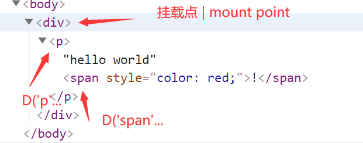

# react-like

手撸 react 框架 | build react-like from scrach

lib 目录下一共 200 行代码，功能不多，旨在方便大家理解视图框架的机制 | 200 line of codes under lib folder, limited feature, aim to show the idea of view framework

## step1: 渲染组件 | render components

```
import { D, render } from '../lib'

let el = document.createElement('div')
document.body.append(el)

render(el, new D('p', {
  children: [
    'hello world',
    new D('span', {
      children: '!',
      style: { color: 'red' }
    })
  ]
}))

```
> 为什么不是 JSX？ why not JSX?

> react只负责这种代码，JSX翻译工作是babel的工作 

> react only work with this type of code, JSX istranslated into such with babel

```
// 等效于JSX | equal to JSX
render(<p>hello world
  <span style={{color:'red'}}>!</span>
</p>)
```


运行代码 | try yourself
```
npm run dev1
```

### 思路 | design

预期 html | expected html



元素和 D 构造是一一对应的，框架也应该是这么工作的，所以只需要按结构递归，不断往上层挂就可以了，关键代码如下，详情参考 [./lib/d.js](./lib/d.js)

just recursive translate D instances into elements and append them to DOM tree [./lib/d.js](./lib/d.js)

```
export class D {
  ...
  init(parent) {
    this.parent = parent
    if (!this.component) {
      // 文本 | text
      this.el = document.createTextNode(this.props.children)
    } else if (typeof this.component == 'string') {
      // 元素 | html element 
      this.el = document.createElement(this.component)
      let { children, ...rest } = this.props
      assignProps(this.el, rest)
      this.children = normalizeDArr(children)
    } else {
      // 组件 | component
      setREACT_LIKE_CUR_COMPONENT(this)
      setREACT_LIKE_CUR_COMPONENT_STATEI(0)
      this.children = normalizeDArr(this.component(this.props))
    }
    // 追加到 DOM 树 | append to DOM tree
    if (this.el) this.parent.append(this.el)
    // 递归初始化子组件/元素 | init children recursively
    this.children.forEach(x => x.init(this.el || this.parent))
  }
  ...
}
```

## step2: 状态 | state

useState 的实现原理是数组计数 | useState store data in array


```
// lib/d.js
export class D {
  constructor(component, props = {}) {
    ...
    this.states = []
    ...
  }

  init(parent) {
    ...
      // 组件 | component
      setREACT_LIKE_CUR_COMPONENT(this)
      setREACT_LIKE_CUR_COMPONENT_STATEI(0)
      this.children = normalizeDArr(this.component(this.props))
    ...
  }
}
```

```
// lib/hooks.js
export function useState(initalValue) {
  let d = getREACT_LIKE_CUR_COMPONENT()
  let i = getREACT_LIKE_CUR_COMPONENT_STATEI()
  if (d.states[i] === undefined) d.states[i] = initalValue
  let v = d.states[i]
  setREACT_LIKE_CUR_COMPONENT_STATEI(i + 1)

  return [v, v1 => {
    d.states[i] = v1
    d.updateState()
  }]
}
```


## step3: 事件 | event

react 事件是统一管理，所以这里用代理模拟 | react event is globally managed, so we mimic it with delegation

```
// lib/event.js
const EVENT_TYPES = ['click']
// 代理挂载点 | delegate from mount point
export function listen(el) {
  return EVENT_TYPES.map(eventType => {
    let listener = e => {
      let key = 'on' + capitalize(eventType)
      bubble(e.target, e, key)
    }
    el.addEventListener(eventType, listener)
  })
}

// 冒泡，直到有对应的事件绑定 | bubble event until it's handled
function bubble(el, e, key) {
  if (!el) return
  if (el[key]) return el[key](e)
  bubble(el.parentElement, e, key)
}

function capitalize(str = '') {
  return str.charAt(0).toUpperCase() + str.slice(1)
}
```

```
// step2/App.js

import { D, useState } from "../lib"

const App = () => {
  let [i, setI] = useState(0)
  let [str, setStr] = useState('hello counter!')
  return [
    str,
    new D('div', {
      children: [
        new D('button', {
          children: '-',
          // onClick 作为prop会被赋值到元素上
          onClick: () => setI(i - 1)
        }),
        i + '',
        new D('button', {
          children: '+',
          // onClick assigned to element as prop
          onClick: () => setI(i + 1)
        })
      ]
    })
  ]
}

export default App
```

```
// lib/d.js
export class D {
  ...
  updateState() {
    this.stateChangeCount++
    // 等待合并 state 更新| wait for changes
    Promise.resolve().then(() => {
      if (!this.stateChangeCount) return
      this.stateChangeCount = 0
      if (this.el) {
        let { children, ...rest } = this.props
        assignProps(this.el, rest)
        if (!this.component) {
          return this.el.data = children
        }
      }
      let children = this.getChildren(this.props)
      ...
  }
  ...
}
```

## 免责 | disclaimer

这个距离 react 的功能和效率还是差很远的，毕竟代码行数在哪里，即使有些可以做的优化我也没加进去，比如应该初始化元素后再追加到 DOM 树，这样能避免 reflow， 因为没有优化的代码更好理解，优化就会有些干扰代码的易读性。 

It's still far from React, just a guide for you to understand it